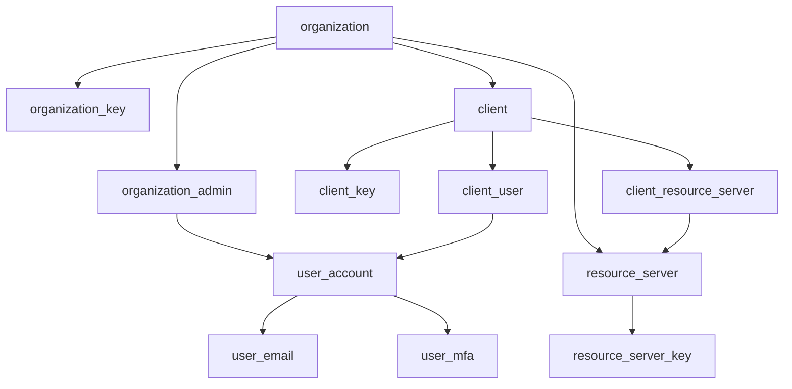
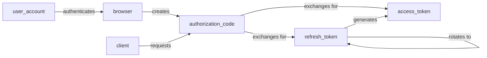
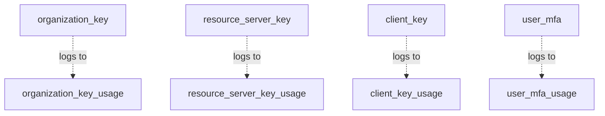

# Auth System - Database Schema

OAuth2 authentication server with enterprise SSO, MFA, and passwordless login support.

**Schema Files:**
- `sqlite/schema.sql` - SQLite 3.45+ implementation
- `postgresql/schema.sql` - PostgreSQL 14+ implementation
- `postgresql/setup_reference.sql` - PostgreSQL prerequisite setup and optional hardening

## Overview

This schema supports:
- **OAuth2 flows**: Authorization Code + PKCE, Client Credentials, Refresh Token Rotation
- **Enterprise features**: Multi-tenant organizations, SSO across clients, session management
- **Security**: MFA (TOTP), passwordless login, recovery codes, email verification
- **Audit**: History tables track all changes, usage logs for security monitoring

## Design Principles

**Identifiers:**
- `pin` - Sequential bigint primary key (internal use, fast joins)
- `id` - UUID for external references (non-enumerable, network-safe)

**Timestamps:**
- `created_at` / `updated_at` - Technical audit fields (auto-managed by triggers)
- `*_at` business fields - Used in application logic (e.g., `generated_at`, `issued_at`)

**History Tables:**
- Companion `history__*` tables track all UPDATEs and DELETEs
- Populated automatically via triggers
- Retain original column types for accurate historical records

**PII Encryption at Rest:**
- `user_account.username` and `user_email.email_address` are AES-256-GCM encrypted (base64url-encoded ciphertext)
- `user_account.username_hash` and `user_email.email_hash` are HMAC-SHA256 blind indexes (64-char hex) for deterministic lookups
- Case-insensitive matching via application-level lowercasing before HMAC (replaces SQL `lower()` / `COLLATE NOCASE`)
- MFA secrets (`user_mfa.secret`) also encrypted with the same derived key

**Soft vs Hard Delete:**
- `is_active` flag for soft-delete where foreign keys or audit require row retention
- Hard DELETE for tokens and other high-volume transient data
- All deletes captured in history tables before removal

## Schema Organization

### Security Domain
Organizations, resource servers, clients, and users.

**Tables:**
- `organization` - Entities that manage resource servers and clients
- `organization_key` - Admin credentials for organizations
- `resource_server` - APIs/services to be secured (audience in tokens)
- `resource_server_key` - Credentials for resource servers (token introspection authentication)
- `client` - Applications that request tokens
- `client_key` - Secrets for confidential clients
- `client_redirect_uri` - Registered OAuth2 callback URLs per client
- `client_resource_server` - Junction: which clients can access which APIs
- `user_account` - Resource owners (people with credentials)
- `user_email` - Email addresses associated with users
- `user_mfa` - MFA methods enrolled by users
- `client_user` - Junction: user membership in public clients
- `recovery_code_set` - MFA backup code generations
- `recovery_code` - Individual backup codes (hashed)
- `organization_admin` - Junction: users with admin access to organizations

### Session Domain
Authentication sessions, OAuth flows, and verification tokens.

**Tables:**
- `browser` - SSO sessions (persist across multiple client authorizations)
- `authorization_code` - Short-lived codes exchanged for tokens
- `refresh_token` - Long-lived tokens for obtaining new access tokens
- `access_token` - Bearer tokens for API access
- `passwordless_login_token` - One-time codes for email-based login
- `email_verification_token` - Confirm email ownership
- `password_reset_token` - Self-service password reset

### Reference/Lookup Domain
Lookup tables for valid values.

**Tables:**
- `grant_type` - OAuth2 grant type descriptions
- `client_type` - Public vs confidential client types
- `code_challenge_method` - PKCE methods (plain, S256)
- `mfa_method` - Available MFA types (TOTP, SMS, etc.)

### Keys Domain
Cryptographic signing keys for JWTs with automatic rotation.

**Tables:**
- `auth_request_signing` - HMAC secrets for stateless authorization code JWTs
- `access_token_signing` - ES256 (ECDSA P-256) keypairs for access token JWTs

**Design:**
- Singleton tables (single row enforced via CHECK constraint)
- Current + prior keys for graceful rotation
- Auto-initialized on first use
- Passive rotation mechanism (checked on every use, rotated when stale)

### Logging Domain
Append-only security event tracking.

**Tables:**
- `client_key_usage` - Confidential client authentication attempts
- `organization_key_usage` - Admin operations tracking
- `user_mfa_usage` - MFA submission attempts (success/failure)

## Entity Relationships

### Security Schema - Organizations and Users



### Session Schema - OAuth2 Token Flow



### Logging Schema - Audit Events



## Key Flows

### Organization Administration

Two complementary mechanisms for organization administration:

1. **`organization_key`** - API credentials for automation and bootstrapping
   - Used by CLI tools and scripts
   - Essential for initial setup (creating first resource servers, clients, user accounts)
   - Can be deleted after initial setup if desired
   - Useful for CI/CD pipelines and infrastructure-as-code

2. **`organization_admin`** - User-based admin access via UI
   - Maps existing user accounts to organization admin privileges
   - Admins authenticate normally (password + MFA) then access admin UI
   - Leverages all existing security (session management, MFA enforcement)
   - More auditable (actions tied to real user identities)

Either mechanism can be used independently or together. Organizations may bootstrap with `organization_key`, then grant admin rights to users and delete the keys.

### Multi-Tenant Isolation

Organizations own both resource servers and clients. The `client_resource_server` junction table enforces that clients can only access APIs within the same organization.

### User Authentication Options

Users can authenticate via:
1. **Password** - Traditional email/username + password
2. **Passwordless** - One-time code sent to email
3. **Both** - User choice at login time

MFA requirements are enforced at authorization time depending on client's policy and user's preference.

### MFA Enrollment and Enforcement

**Two-Flag System:**
- `user_account.has_mfa` - Auto-managed enrollment status (does user have any confirmed MFA methods?)
- `user_account.require_mfa` - User preference (enforce MFA even when client doesn't require it)

**Enforcement Logic:**
```
MFA required = client.require_mfa OR user.require_mfa
```

**Constraint Enforcement:**
- Database CHECK constraint ensures `require_mfa = 1` implies `has_mfa = 1` (cannot require MFA without enrollment)
- Deleting the last MFA method automatically clears both flags in the same transaction

**Enrollment Flow (Two-Step Confirmation):**
1. User initiates enrollment (POST /api/user/mfa/methods)
2. Server generates secret/code, creates `user_mfa` record with `is_confirmed = 0`
3. User proves control (TOTP code from authenticator app, or SMS code from phone)
4. Server verifies code, sets `is_confirmed = 1`, updates `user.has_mfa = 1`
5. First enrollment generates recovery codes automatically

**Method Types:**
- **TOTP** - Time-based one-time passwords via authenticator applications
  - Server generates base32-encoded secret
  - User scans QR code or manually enters secret
  - Time-based 6-digit codes (30-second window)
- **SMS** - Phone number verification (future)
  - Server sends numeric code via SMS
  - User enters code to confirm

**Multiple Methods:**
- Users can enroll multiple methods (e.g., multiple devices/phone numbers)
- Each method has user-chosen `display_name` for identification
- Login flow presents method selection dropdown
- Only `is_confirmed = 1` methods are usable for authentication

**Recovery Codes:**
- Generated as a set on first MFA enrollment
- Stored hashed with shared salt (efficient verification)
- Single-use (marked `is_used = 1` after consumption)
- Regeneration creates new set, revokes old set

### Browser Session SSO

A single `browser` session enables SSO across multiple clients:
1. User logs into Client A (password + MFA)
2. Browser session created
3. User visits Client B (same organization or different)
4. If session is valid and within Client B's `maximum_session_seconds`, auto-approve
5. No re-authentication needed

### Refresh Token Rotation

Refresh tokens are single-use with chain tracking:
1. Exchange auth code → Get RT1 + AT1
2. Use RT1 → Get RT2 + AT2 (RT1 marked `is_exchanged`)
3. Use RT2 → Get RT3 + AT3 (RT2 marked `is_exchanged`)
4. If RT1 reused → Revoke entire chain (security breach detected)

Chain tracking via `origin_refresh_token_id` and `generation` fields.

## Key Implementation Details

### Stateless Authorization Requests

**Critical Design Decision:** There is **no `authorization_request` table** in this schema.

**Why:** Prevents DoS attacks where unauthenticated users create unlimited DB records. Instead, authorization state is carried in signed JWTs that are verified server-side before creating the `authorization_code` record.

### Token Exchange Protection

Partial unique indexes enforce single-use semantics for authorization codes and refresh tokens, preventing replay attacks:

- Only one refresh token can be created from a given authorization code
- Only one access token can be created directly from an authorization code
- Only one access token can be created from a given refresh token exchange
- Each generation in a refresh token rotation chain must be unique (prevents duplicate generations)

### Refresh Token Rotation

Refresh tokens are single-use with chain tracking via `origin_refresh_token_id` and `generation` fields. If an already-exchanged token is reused (replay attack detected), the entire chain can be revoked in a single query.

### Multi-Tenant Isolation

Composite foreign keys in `client_resource_server` enforce that clients can only access resource servers within the same organization, preventing cross-tenant privilege escalation.

### Redirect URI Validation

The `client_redirect_uri` table stores registered OAuth2 callback URLs for each client. Per OAuth2 spec (RFC 6749):

- If a client has **one** registered redirect URI, the `redirect_uri` parameter is **optional** in authorization requests (server uses the registered URI)
- If a client has **multiple** registered URIs, the `redirect_uri` parameter is **required** (client must specify which one)
- Validation uses **exact match only** - no prefix matching, no wildcards (prevents authorization code interception attacks)

### Universal Clients

The `client.is_universal` flag enables special public clients (like system management UIs) to be accessible by **any authenticated user** without requiring explicit membership in the `client_user` table.

**Constraints:**
- Only `public` clients can be universal (constraint enforced in schema)
- Authorization logic checks: if `is_universal = true`, skip `client_user` membership check
- Intended for platform-wide applications (management dashboards, user profile pages)

### Secret Verification

**Key Identification Required:**
- `organization_key` and `client_key` verification requires the key ID to be provided alongside the secret value
- Enables single-hash verification (no iteration over multiple candidates)
- Improves auditability by logging which specific key was used
- API details documented in `api/README.md`

**Recovery Code Verification:**
- Recovery codes use a shared-salt design for efficient verification
- `salt` and `hash_iterations` are stored in `recovery_code_set` (not per-code)
- All codes in a set share the same salt and iteration count
- Verification: hash user input once with set parameters, compare against all code hashes
- Secure because codes are high-entropy random strings (not user-chosen passwords)

### Log Tables

High-volume logging tables (`*_usage`) have no primary key to optimize insert performance. Records are append-only and can be bulk-deleted by timestamp for retention management.

### Signing Key Rotation

The `auth_request_signing` and `access_token_signing` tables support automatic key rotation with zero-downtime transitions:

**Rotation Intervals:**
- HMAC secrets: 24 hours
- ES256 keypairs: 60 days

**Passive Rotation Mechanism:**
1. On first use: No keys exist → generate and INSERT
2. On subsequent uses: Load key, check `current_generated_at` age
3. If stale (age > rotation interval): Generate new key, UPDATE (prior=current, current=new)
4. If fresh: Return current key

**Grace Period:**
- Tokens signed with "prior" key remain valid during transition
- JWT verification tries current key first, falls back to prior key
- Grace period duration = rotation interval
- Prevents invalidation of recently-issued tokens

**Concurrency Safety:**
- Rotation query uses `BEGIN IMMEDIATE` transaction (SQLite)
- Prevents concurrent rotations from multiple processes
- First process wins, others use the newly-rotated key

## Database Cleanup & Maintenance

### Automatic Cleanup System

A background cleaner thread continuously purges old transient data to prevent unbounded database growth:

**Target tables:** Sessions, tokens (access/refresh/auth codes/passwordless/verification/reset), usage logs (client/resource server/organization keys, MFA), unconfirmed MFA methods, used recovery codes, revoked recovery code sets, and history tables.

**Retention periods:** Configurable for usage logs (default 60 days), history tables (default 90 days), sessions/tokens grace periods (default 8 days). Short-lived tokens use hardcoded retention (1-7 days).

**Configuration:**
```ini
# auth.conf
cleaner_enabled = true
cleaner_interval_seconds = 10
cleaner_batch_size = 1000
cleaner_sqlite_vacuum_pages = 100
cleaner_postgres_vacuum_enabled = true

retention_usage_logs_days = 60
retention_history_days = 90
retention_sessions_grace_days = 8
retention_tokens_grace_days = 8
```

### Cleanup Indexes

Cleanup queries filter on timestamp columns to identify purgeable rows. Indexes support efficient range scans:

**Timestamp-only indexes** (for tables with no additional filter conditions):
```sql
CREATE INDEX idx_browser_expected_expiry ON browser(expected_expiry);
CREATE INDEX idx_access_token_expected_expiry ON access_token(expected_expiry);
-- ... (7 total session/token tables)

CREATE INDEX idx_client_key_usage_authenticated_at ON client_key_usage(authenticated_at);
-- ... (4 total usage log tables)
```

**Composite indexes** (for tables with business logic filters):

When queries include both equality and range conditions, **leading with equality provides better selectivity:**

```sql
-- Purges unconfirmed MFA methods: WHERE is_confirmed = 0 AND created_at < X
CREATE INDEX idx_user_mfa_cleanup ON user_mfa(is_confirmed, created_at);

-- Purges used recovery codes: WHERE is_used = 1 AND used_at < X
CREATE INDEX idx_recovery_code_cleanup ON recovery_code(is_used, used_at);

-- Purges revoked recovery sets: WHERE is_active = 0 AND revoked_at < X
CREATE INDEX idx_recovery_code_set_cleanup ON recovery_code_set(is_active, revoked_at);
```

**Why equality-first column ordering?**
- Database jumps directly to matching boolean partition (`is_confirmed = 0`)
- Then performs range scan only within that partition
- Much smaller search space than scanning all old timestamps first

**History table indexes:**
- Automatically created when history tables are generated
- Index on `history_created_at` for efficient purging of old audit records

### SQLite-Specific: Incremental Vacuum

**Pragma set at initialization:**
```sql
PRAGMA auto_vacuum = INCREMENTAL;
```

Must be set on an empty database before tables are created. Enables gradual space reclamation:

```sql
PRAGMA incremental_vacuum(100);  -- Frees 100 pages
```

The cleaner runs incremental vacuum after each batch delete, gradually shrinking the database file without blocking operations.

### PostgreSQL-Specific: Manual VACUUM

After each batch delete, the cleaner optionally runs:
```sql
VACUUM table_name;
```

**Behavior:**
- Marks dead tuples as reusable
- Does NOT shrink file (use `VACUUM FULL` offline for that)
- Non-blocking for reads/writes
- Coexists safely with PostgreSQL's built-in autovacuum

**Configurable:** Set `cleaner_postgres_vacuum_enabled = false` to rely entirely on autovacuum.

### Cleanup Performance

**Design characteristics:**
- Small batch deletes (1000 rows) with brief locks
- 10-second interval between table checks (low overhead)
- Randomized table rotation (prevents thundering herd in horizontal scaling)
- Dedicated database connection (doesn't compete with request workers)
- Graceful shutdown via condition variable (instant wake on stop signal)

**Expected overhead:** ~1-2% CPU in high-traffic scenarios, negligible in low-traffic deployments.
